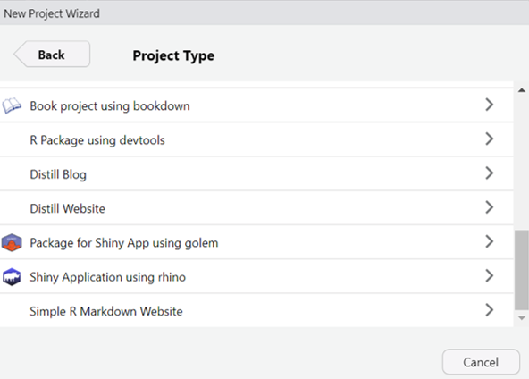

# Exercise 1 - Hello World!

## Step 1

Start your `Rhino` with either

``` r
rhino::init("my-first-rhino-app") 
```

Or Create New Project feature with R studio:



## Step 2

-   Enable automatic reloading with

``` r
shiny::devmode()
```

-   Run the app with

``` r
shiny::runApp()
```

## Step 3

-   Edit the displayed message in `app/main.R` and see how the app automatically reloads.

``` r
box::use(
  shiny[bootstrapPage, div, moduleServer, NS, renderUI, tags, uiOutput],
)

#' @export
ui <- function(id) {
  ns <- NS(id)
  bootstrapPage(
    uiOutput(ns("message"))
  )
}

#' @export
server <- function(id) {
  moduleServer(id, function(input, output, session) {
    output$message <- renderUI({
      div(
        style = "display: flex; justify-content: center; align-items: center; height: 100vh;",
        tags$h1(
           tags$a("Hello, World! Check out Rhino docs!", 
                  href = "https://appsilon.github.io/rhino/")
        )
      )
    })
  })
}
```

## Step 4 

-  Try `shiny::runExample ("01_hello")`

-  Convert a traditional shiny app into a modular Rhino app script 

-  Check the traditional shiny app script [../exercise/01_hello.R]

-  Complete the modular Rhino app script [../exercise/01_hello_rhino.R]

-  Copy the syntax and create your /app/view/hist.R 


